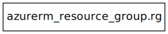

# starter-terraform-azure

TerraformでAzureリソースを管理するスターターテンプレートです。

- [Terraform構成](#Terraform構成)
- [実行手順](#実行手順)
- [コントリビューションガイドライン](#コントリビューションガイドライン)

## Terraform構成


<!-- BEGIN_TF_DOCS -->
### Requirements

| Name | Version |
|------|---------|
| <a name="requirement_terraform"></a> [terraform](#requirement\_terraform) | ~> 1.14.0 |
| <a name="requirement_azurerm"></a> [azurerm](#requirement\_azurerm) | ~> 4.57.0 |

### Providers

| Name | Version |
|------|---------|
| <a name="provider_azurerm"></a> [azurerm](#provider\_azurerm) | 4.57.0 |

### Modules

No modules.

### Resources

| Name | Type |
|------|------|
| [azurerm_resource_group.rg](https://registry.terraform.io/providers/hashicorp/azurerm/latest/docs/resources/resource_group) | resource |

### Inputs

| Name | Description | Type | Default | Required |
|------|-------------|------|---------|:--------:|
| <a name="input_subscription_id"></a> [subscription\_id](#input\_subscription\_id) | AzureサブスクリプションID | `string` | n/a | yes |

### Outputs

| Name | Description |
|------|-------------|
| <a name="output_resource_group_name"></a> [resource\_group\_name](#output\_resource\_group\_name) | リソースグループ名 |
<!-- END_TF_DOCS -->

## 実行手順

1. Azureへのログイン

    ```bash
    az login
    ```

2. 整形し構文をチェック

    ```bash
    terraform fmt -recursive && terraform validate
    ```

3. 品質のチェック

    ```bash
    tflint --recursive
    ```

4. セキュリティー及びコンプライアンスのチェック

    ```bash
    checkov -d .
    ```

5. ドキュメントの生成

    ```bash
    terraform-docs markdown .
    ```

6. リソースグラフの生成

    ```bash
    terraform graph | dot -Tsvg > resource-graph.svg
    ```

7. 変更予定内容の確認

    ```bash
    terraform plan
    ```

8. 変更の適用

    ```bash
    terraform apply
    ```

## コントリビューションガイドライン

コントリビューターの方は、[CONTRIBUTING.md](./docs/CONTRIBUTING.md)を確認してください。
