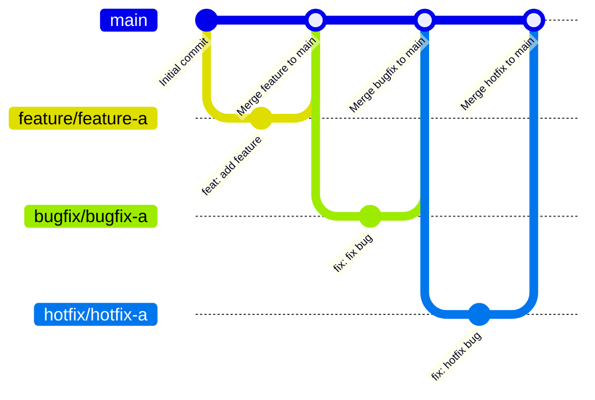

# コントリビューションガイドライン

Thank you for contributing!

コントリビューターの方は、次のガイドラインに沿ってコントリビュートしてください。

- [セットアップ手順](#セットアップ手順)
- [ブランチ戦略](#ブランチ戦略)
- [コミットメッセージ規約](#コミットメッセージ規約)
- [プルリクエストテンプレート](#プルリクエストテンプレート)

## セットアップ手順

### 自動セットアップ

開発コンテナーを利用して自動セットアップを行えます。セットアップ内容は[devcontainer.json](../.devcontainer/devcontainer.json)で確認できます。

### 手動セットアップ

手動でセットアップを行う場合は、以下の手順で作業を行なってください。

#### パッケージの更新と不要パッケージの削除

```bash
sudo apt update && sudo apt full-upgrade -y && sudo apt autoremove -y
```

#### tenvのインストール

Terraformのバージョンマネージャーとして、[tenv](https://github.com/tofuutils/tenv)をインストールします。

1. Cloudsmithリポジトリの登録

    ```bash
    curl -fsLS 'https://dl.cloudsmith.io/public/tofuutils/tenv/cfg/setup/bash.deb.sh' | sudo bash
    ```

2. tenvのインストール

    ```bash
    sudo apt install tenv
    ```

#### Terraformのインストール

tenvを使用して、Terraformをインストールします。

1. 許可されている最新バージョンのTerraformをインストール

    ```bash
    tenv tf install latest-allowed
    ```

2. 許可されている最新バージョンのTerraformに切り替え

    ```bash
    tenv tf use latest-allowed
    ```

3. Terraformの初期化

    ```bash
    terraform init
    ```

#### TFLintのインストール

Terraformのリンターとして、[TFLint](https://github.com/terraform-linters/tflint)をインストールします。インストール中に必要になるunzipを先にインストールします。

1. unzipのインストール

    ```bash
    sudo apt install unzip
    ```

2. TFLintのインストール

    ```bash
    curl -fsLS 'https://raw.githubusercontent.com/terraform-linters/tflint/master/install_linux.sh' | bash
    ```

3. TFLintの初期化

    ```bash
    tflint --init
    ```

#### checkovのインストール

セキュリティー及びコンプライアンスチェッカーとして、[checkov](https://github.com/bridgecrewio/checkov)をインストールします。インストールに必要になるpipxを先にインストールします。

1. pipxのインストール

    ```bash
    sudo apt install pipx
    ```

2. pipxのパス設定と有効化

    ```bash
    pipx ensurepath && source ~/.bashrc
    ```

2. checkovのインストール

    ```bash
    pipx install checkov
    ```

#### terraform-docsのインストール

ドキュメントの自動生成ツールとして、[terraform-docs](https://github.com/terraform-docs/terraform-docs)をインストールします。

1. terraform-docsのインストール

    ```bash
    curl -fsLS https://github.com/terraform-docs/terraform-docs/releases/download/v0.21.0/terraform-docs-v0.21.0-linux-amd64.tar.gz \
    | tar -xOzf - terraform-docs \
    | sudo tee /usr/local/bin/terraform-docs > /dev/null \
    && sudo chmod +x /usr/local/bin/terraform-docs
    ```

#### Graphvizのインストール

リソースグラフを作成するために[Graphviz](https://gitlab.com/graphviz/graphviz)をインストールします。

1. Graphvizのインストール

    ```bash
    sudo apt install graphviz
    ```

#### pre-commitのインストール

コミット前にコードの整形や構文チェック等を自動で実行するためにpre-commitを設定します。実行内容は[.pre-commit-config.yaml](../.pre-commit-config.yaml)で設定しています。

1. pre-commitのインストール

    ```bash
    pipx install pre-commit
    ```

2. pre-commitの初期化

    ```bash
    pre-commit install
    ```

#### Azure CLIのインストール

TerraformがAzureへの認証を行えるようにAzure CLIをインストールしておきます。

1. Azure CLIのインストール

    ```bash
    curl -fsLS 'https://aka.ms/InstallAzureCLIDeb' | sudo bash
    ```

## ブランチ戦略

ブランチは、GitHub flowを基にした次のようなフローで運用しなければなりません。



使用できるブランチの一覧と各ブランチの用途及び運用ルールは次のとおりです。

| ブランチ | 用途 | 運用ルール |
|-----------|------|-----------|
| **`main`** | 🛡️ 本番環境 | ・直接プッシュ禁止<br>・削除禁止<br>・プルリクエスト経由でのみ更新 |
| **`feature/<feature-name>`** | 🌱 機能開発 | ・`main`から作成<br>・完了後にプルリクエストを作成し`main`へマージ<br>・マージ後は削除 |
| **`bugfix/<bugfix-name>`** | 🔧 バグ修正 | ・`main`から作成<br>・修正後にプルリクエストを作成し`main`へマージ<br>・緊急性が高い場合は`hotfix`を使用<br>・マージ後は削除 |
| **`hotfix/<hotfix-name>`** | ⚡ 緊急のバグ修正（本番障害・重大不具合等） | ・`main`から作成<br>・修正後にプルリクエストを作成し`main`へマージ<br>・マージ後は削除 |

ブランチ名の`<feature-name>`、`<bugfix-name>`及び`<hotfix-name>`には、英小文字（a–z）、数字（0–9）及びハイフン（-）以外を使用してはなりません。

## コミットメッセージ規約

コミットメッセージは、[Conventional Commits 1.0.0](https://www.conventionalcommits.org/ja/v1.0.0/)の仕様を基にした次のような形にしなければなりません。

```
<type>[optional scope]: <description>

[optional body]

[optional footer(s)]
```

使用できる`<type>`の一覧と各`<type>`の説明は次のとおりです。

| `<type>` | 説明 |
|----------|------|
| **`build`** | 🛠️ ビルドシステムや外部依存関係に影響する変更 |
| **`chore`** | ♻️ プログラム本体やテスト以外の変更 |
| **`ci`** | ⚙️ CI設定ファイルやスクリプトの変更 |
| **`docs`** | 📚 ドキュメントのみの変更 |
| **`feat`** | ✨ 新機能 |
| **`fix`** | 🐛 バグ修正 |
| **`perf`** | 🚀 パフォーマンスを改善するコード変更 |
| **`refactor`** | 📦 バグ修正や機能追加ではないコード変更 |
| **`revert`** | 🗑️ 以前のコミットを取り消す変更 |
| **`style`** | 💎 コードに影響を与えない変更（空白、フォーマット、セミコロン不足等） |
| **`test`** | 🚨 不足しているテストの追加又は既存テストの修正 |

`<description>`は、先頭を小文字とし、英語の命令形で簡潔に記載しなければなりません。また、末尾にピリオドを付けてはなりません。

許容されるコミットメッセージの例は次のとおりです。

```
feat: add support for additional data formats
```

```
fix: correct incorrect validation logic
```

```
docs: add installation guide for new users
```

## プルリクエストテンプレート

プルリクエストは、[pull_request_template.md](./pull_request_template.md)に沿って行わなければなりません。
